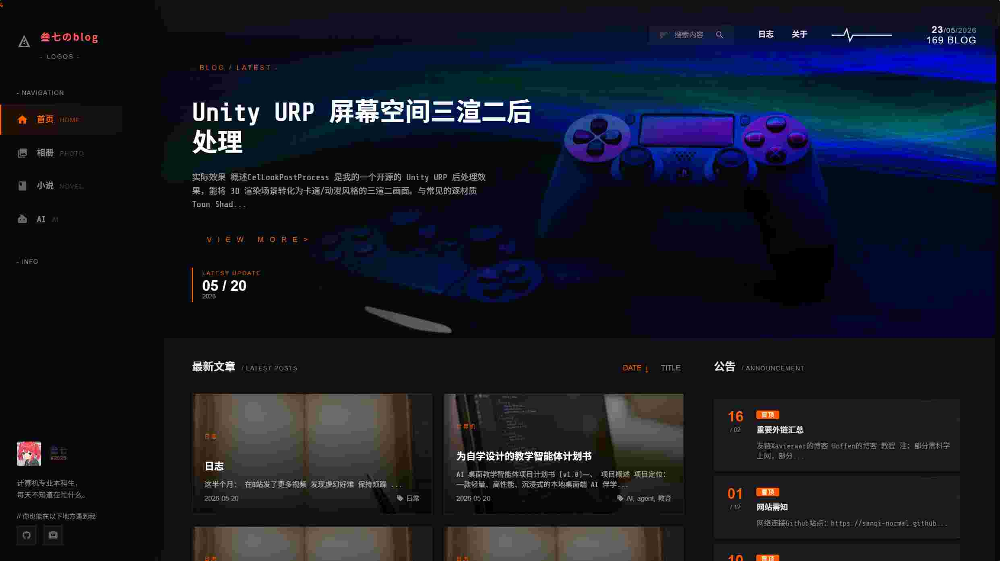

# hexo-theme-Tech

Tech 是一个风格简明、动效丰富的 Hexo 主题，在[3-hexo](https://github.com/yelog/hexo-theme-3-hexo)的基础上完全重构了布局和样式。

最初它的目的在于构造一个简单的战术风博客主题，当前随着改进它已成为包容多种风格可以任意新增和切换风格的主题。

<table>
<tr>
    <td></td>
    <td></td>
    <td></td>
</tr>
</table>
<table>
<tr>
    <td></td>
    <td></td>
    <td></td>
</tr>
</table>
**在线体验**：https://sanqi-normal.github.io/


## 特点
- **内置多种风格一键切换**
- **体验丝滑流畅**
- **包含多种音效**
- **内置可视化音乐播放器**
- **文章内图片可做封面图预览**
- **样式与布局解耦，风格系统支持热插拔**
- **易于扩展**


## 安装

```bash
git clone https://github.com/Sanqi-normal/tech-hexo.git themes/tech-hexo
```

## 配置

修改 Hexo 根目录下的 `_config.yml`：

```yaml
theme: tech-hexo
```

## 主题配置相关

### 有关封面图

当文章内包含图片时，会首先使用第一张图片作为封面图；如果没有图片，则使用主分类对应的默认图

当新增一种分类时，要为这个分类在 `source/img/categories`  中添加[分类名].jpg作为此分类的默认图，否则会进一步回退到纯色背景。

### 有关图标

想要为导航栏添加图标，需在`source/img/navigation`下添加同名svg图片
社交链接图标同理，在`source/img/socail`下添加同名svg图片

### 有关音乐

在`source/music`下添加任意数量的mp3格式音频，会自动读取列表并顺次播放

### 有关音效

你可以通过用自己的音频替换掉`source/audio`下音频来替换点击等音效，注意保持命名一致

### 有关风格切换

主题内置了 **5 种** 视觉风格，点击右侧工具栏的调色板图标即可一键切换：

| 风格 | 说明 |
|------|------|
| 机能风 | 默认风格，深色战术风基调 |
| 简约风 | 浅色极简风格，蓝白配色 |
| 漫画风 | 莫比斯漫画风格，鲜亮色彩与半调纹理 |
| 街头风 | 融合了酸性主义的都市潮流风格，高对比度黑白黄 |
| 西幻风 | 西幻羊皮纸手绘风格，衬线字体 |

#### 新增风格（热插拔）

风格系统支持完全热插拔，新增一个风格只需要放入 **两个文件**，无需修改任何配置或代码：

1. 在 `source/css/_partial/` 下新建 `.styl` 文件，**首行** 必须包含元数据注释：

   ```stylus
   /* @theme <显示名称> <data-theme属性值> */
   ```

   例如创建一个叫 `ocean.styl` 的海洋主题：

   ```stylus
   /* @theme 海洋风 ocean */
   [data-theme='ocean'] {
       --bg-sidebar: #0a1628;
       --bg-main: #0d2137;
       /* ... 其他样式变量与规则 */
   }
   ```

   > `data-theme` 属性值推荐与文件名一致。唯一的例外是机能风默认主题，其 `data-theme` 值为 `dark`（CSS 中对应 `:root` 而非 `[data-theme]` 选择器）。

2. 在 `source/img/feature/` 下放入同名的 `.svg` 图标文件作为调色板入口。

3. 刷新即可在调色板看到新风格入口

移除风格同样简单：删除对应的 `.styl` 文件和 `.svg` 图标即可。


## 致谢

作者yelog的[3-hexo](https://github.com/yelog/hexo-theme-3-hexo)主题